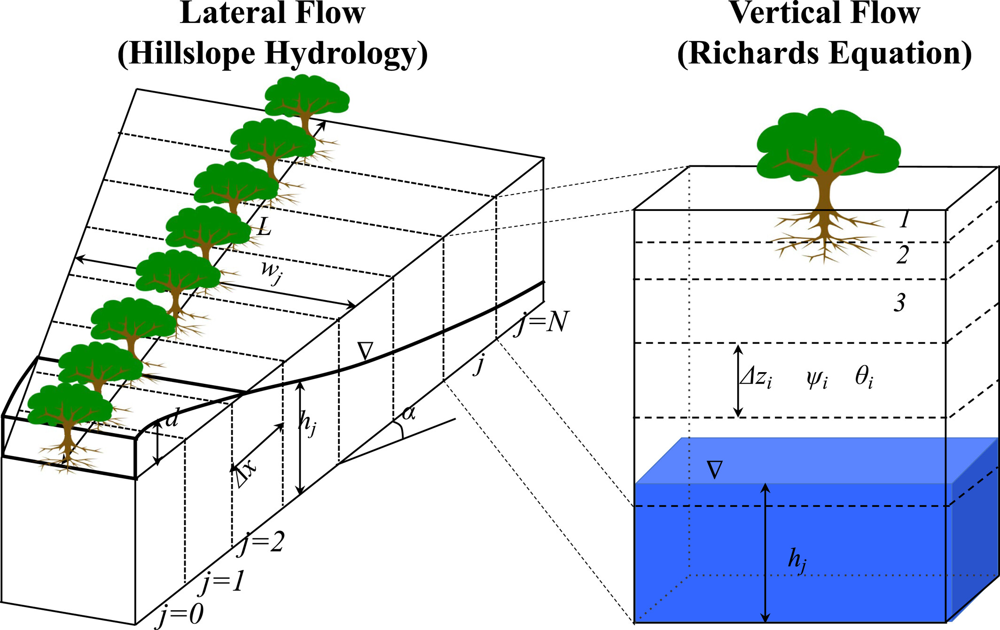

# Hybrid-3D hillslope hydrological model

## Overview

H3D represents subsurface lateral flow and groundwater dynamics within an idealized hillslope unit inside each land 
grid cell. Rather than treating each soil column as an isolated vertical profile, 
h3D connects multiple columns along a topographic gradient to explicitly simulate downslope drainage, 
water table redistribution, and interaction with the channel.

This approach is conceptually one-dimensional along the hillslope, 
but retains three-dimensional realism by including slope, width, and drainage area variation.
The model solves the Dupuit–Boussinesq groundwater flow equation for saturated thickness using an implicit finite-difference method.

In order to use this model, the following variables need to be added in the surface dataset:

hs_x(begg:endg, 1:nh3dc_per_lunit+1): x‐coordinates (m) of the node/edge positions along the hillslope for each grid cell g. There are N+1 nodes for N columns.

hs_w(begg:endg, 1:nh3dc_per_lunit+1): width function values (m) at those nodes (planform width vs. distance).

hs_area(1:nh3dc_per_lunit): Planform area between nodes k and k+1 is calculated using a trapezoid, area each column are then normalized to the total area and used later for area-weighted averages/sums across the set of hillslope columns 
within a land unit (e.g., to compute landunit-level means of fluxes or states).

## Conceptual Representation

Each land unit is subdivided into several h3D columns positioned along an idealized hillslope:

- Lower boundary corresponds to the stream outlet.
- Upper boundary represents the local topographic divide.
- Intermediate nodes represent soil columns along the slope.



Figure 1. The hybrid-3D hillslope hydrological model represents subsurface and surface flow along an idealized hillslope. Left panel (plan view):
A hillslope of total length $L$ is divided into $N$ vertical soil columns, each with an equal horizontal length $\Delta x$, underlain by bedrock with a topographic slope $\alpha$.
The width of the hillslope at a given position is denoted by $W(x)$, measured from the lower boundary of the lowest column (column 0).
The column index $j$ refers to the center of each hillslope column.
Land-surface properties such as bedrock depth, vegetation cover, and atmospheric forcing are assumed to be identical for all columns.
The variable $d$ represents the depth of overland flow above the surface. Right panel (vertical section):
Each hillslope column consists of multiple soil layers of variable thickness $\Delta z_i$.
Vertical flow through the unsaturated and saturated zones occurs across these layers with corresponding soil water potentials $\psi_i$.
The flow domain extends down to an impermeable bedrock boundary, which imposes a zero-flux condition at the bottom.
Vertical flow is solved using the $\alpha$-based form of the Richards equation (Zeng & Decker, 2009).
The layer index $i$ denotes vertical soil layers, $h$ is the height of the saturation zone, and $\nabla$ marks the position of the water table.

For each node, the state variable is the saturated thickness, $h_{sat}(x,t)$, measured from the bedrock to the water table. 
The model tracks how $h_{sat}(x,t)$ evolves in time due to:

- Local recharge (vertical infiltration)
- Downslope lateral flow driven by topographic gradients
- Variable transmissivity and drainable porosity along the slope


Each land unit represents a single hillslope, which has consistent topographic and geometric properties:
- **Overall slope angle:** $\alpha$ — mean hillslope angle (rad)
- **Width function:** $w(x)$ — lateral width distribution along the hillslope (m)
- **Distance function:** $x(i)$ — distance from the stream outlet to node $i$ (m)
- **Total hillslope area:** $A_{hs} = \displaystyle \int_0^L w(x)\ dx$ (m²)

Each column is a point along hillslope, representing a cross-section at distance x along the hillslope. Each has local properties, connected by lateral flow to adjacent columns:
- Soil hydraulic properties (K_sat, porosity, etc.)
- Local area contribution (hs_dA)
- Bedrock depth

Land unit captures the hillsclope-scale connectivity, while columns capture spatial variation along the flow path. Each column contributes proportionally to the area within the land unit, conserves water mass at hillslope scale, having realistic flow convergence/divergence. Column 1 = stream/outlet, column N = hillslope divide.


## Govergning Equation

The fundamental PDE is a Dupuit-style Boussinesq groundwater flow equation for saturated flow along the slope:

$$
f\frac{\partial h}{\partial t} = \frac{1}{w}\frac{\partial}{\partial x}\left(w\ k_{l}(h)\ h\left(\sin(\alpha) + \frac{\partial h}{\partial x}\cos(\alpha)\right)\right) + \cos(\alpha)\ R
$$

where $h(x,t)$ is the saturated thickness [m],
$f$ is the drainable porosity [–],
$\alpha$ is the hillslope angle [rad],
$w(x)$ [m] is the hillslope width at distance $x$ from the outlet,
$k_l(h)$ [m s⁻¹] is the lateral saturated hydraulic conductivity,
and $R$ [m s⁻¹] is the recharge rate from the unsaturated zone.
The recharge term $R$ appears in this theoretical formulation but is not
included in the current numerical implementation (the `LateralResponse`
subroutine).

## Boundary Conditions

| Boundary       | Condition                                       |
| :------------- | :---------------------------------------------- |
| Lower (stream) | $h_0 = 0$ (Dirichlet: stream saturated thickness = 0) |
| Upper (divide) | zero lateral flux $\left(c_N = 0\right)$        |

## Constitutive Relationships (from the code)

### Transmissivity

The width-transmissivity product at node $k$ is

$$
T_k = \frac{K_{\text{aniso}}\, K_{\text{sat},k}\, h_k\, w_k}{1000}
$$

where $K_{\text{aniso}}=100$ is the horizontal/vertical anisotropy factor,
$K_{\text{sat},k}$ [mm s⁻¹] is the saturated hydraulic conductivity at
the soil layer immediately above the water table
(layer index $\min(j_{wt}+1,\,N_{bed})$),
$h_k$ [m] is the saturated thickness at node $k$, and $w_k$ [m] is the
hillslope width at node $k$.
Division by 1000 converts mm s⁻¹ to m s⁻¹.
$T_k$ has units m³ s⁻¹ (a width-integrated transmissivity), and
in the finite-difference stencil the interface value
$T_{i+1/2}$ is approximated by the value at the uphill node $T_{i+1}$.

### Variable Drainable Porosity

The specific yield varies with depth following a Brooks–Corey relation:

$$
f_{\text{drain}}
= \theta_{\text{sat}}
\left[
1 -
\left(
1 +
\frac{z_{wt}}{\psi_{\text{sat}}}
\right)^{-1/b}
\right],
\qquad
f_{\text{drain}}\ge0.02
$$

where $\theta_{\text{sat}}$ is porosity [–],
$z_{wt} = 1000\,\max(0,\,z_{\text{bed}}-h)$ [mm] is the water-table
depth converted to mm (with $z_{\text{bed}}$ [m] the effective bedrock
reference depth `zwtbed` and $h$ [m] the saturated thickness),
$\psi_{\text{sat}}$ [mm] is the air-entry suction (`sucsat`),
and $b$ is the Clapp–Hornberger exponent (`bsw`).
All soil properties are evaluated at the layer immediately above the
water table (layer index $\min(j_{wt}+1,\,N_{bed})$).

This function ensures a smooth transition between unsaturated and fully saturated conditions and maintains stability under variable soil thickness.


## Numerical Implementation

### Spatial Discretization

The PDE is solved implicitly in space and time using a tridiagonal
system for $h_i^{t}$ at each node $i$ at time t. Node is ordered from 1 to N:

$$
a_i h_{i-1}^{t,s+1} + b_i h_i^{t,s+1} + c_i h_{i+1}^{t,s+1} = r_i^{t,s}
$$

where t and t-1 are current and previous time step, s+1 and s are current and previous iteration.

#### Derivation

- Lower boundary ($i=1$, stream)

$$
\begin{aligned}
f\left(h_{1}^{t,s+1}-h_{1}^{t-1}\right)
&= \frac{\Delta t\ \sin(\alpha)}{w_{1}\ \Delta x_{1}}
\left(w_{\frac{3}{2}}\ k_{l_{\frac{3}{2}}}^{t,s}\ h_{\frac{3}{2}}^{t,s}\right) \\
&\quad + \frac{\Delta t\ \cos(\alpha)}{w_{1}\ \Delta x_{1}}
\left(
\frac{w_{\frac{3}{2}}\ k_{l_{\frac{3}{2}}}^{t,s}\ h_{\frac{3}{2}}^{t,s}}{\Delta x_{U_{1}}}
\left(h_{2}^{t,s+1}-h_{1}^{t,s+1}\right)
\right) \\
&\quad + \Delta t\ \cos(\alpha)\ R_{\mathrm{sat},1}^{t}\ .
\end{aligned}
$$

$$
a_1 h_0^{t,s+1} + b_1 h_1^{t,s+1} + c_1 h_2^{t,s+1} = r_1
$$

$$
\begin{aligned}
&\text{where:} \\
&a_1 = 0 \\
&b_1 = f + \frac{\Delta t\ \cos(\alpha)}{w_1\ \Delta x_1} \cdot \frac{w_{\frac{3}{2}}\ k_{l_{\frac{3}{2}}}^{t,s}\ h_{\frac{3}{2}}^{t,s}}{\Delta x_{U_1}} \\
&c_1 = -\frac{\Delta t\ \cos(\alpha)}{w_1\ \Delta x_1} \cdot \frac{w_{\frac{3}{2}}\ k_{l_{\frac{3}{2}}}^{t,s}\ h_{\frac{3}{2}}^{t,s}}{\Delta x_{U_1}} \\
&r_1 = f h_1^{t-1} + \frac{\Delta t\ \sin(\alpha)}{w_1\ \Delta x_1}\left(w_{\frac{3}{2}}\ k_{l_{\frac{3}{2}}}^{t,s}\ h_{\frac{3}{2}}^{t,s}\right) + \Delta t\ \cos(\alpha)\ R_{\mathrm{sat},1}^{t}
\end{aligned}
$$


- Interior nodes ($i=2,\dots,N-1$)

$$
\begin{aligned}
f\left(h_{i}^{t,s+1}-h_{i}^{t-1}\right)
&= \frac{\Delta t\ \sin(\alpha)}{w_{i}\ \Delta x_{i}}
\left(w_{i+\frac{1}{2}}\ k_{l_{i+\frac{1}{2}}}^{t,s}\ h_{i+\frac{1}{2}}^{t,s}
     - w_{i-\frac{1}{2}}\ k_{l_{i-\frac{1}{2}}}^{t,s}\ h_{i-\frac{1}{2}}^{t,s}\right) \\
&\quad + \frac{\Delta t\ \cos(\alpha)}{w_{i}\ \Delta x_{i}}
\left(
\frac{w_{i+\frac{1}{2}}\ k_{l_{i+\frac{1}{2}}}^{t,s}\ h_{i+\frac{1}{2}}^{t,s}}{\Delta x_{U_{i}}}
\left(h_{i+1}^{t,s+1}-h_{i}^{t,s+1}\right) \right. \\
&\qquad \left. - \frac{w_{i-\frac{1}{2}}\ k_{l_{i-\frac{1}{2}}}^{t,s}\ h_{i-\frac{1}{2}}^{t,s}}{\Delta x_{L_{i}}}
\left(h_{i}^{t,s+1}-h_{i-1}^{t,s+1}\right)
\right) \\
&\quad + \Delta t\ \cos(\alpha)\ R_{\mathrm{sat},i}^{t}\ .
\end{aligned}
$$


$$
a_i h_{i-1}^{t,s+1} + b_i h_i^{t,s+1} + c_i h_{i+1}^{t,s+1} = r_i 
$$

$$
\begin{aligned}
&\text{where:} \\
&a_i = \frac{\Delta t\ \cos(\alpha)}{w_i\ \Delta x_i} \cdot \frac{w_{i-\frac{1}{2}}\ k_{l_{i-\frac{1}{2}}}^{t,s}\ h_{i-\frac{1}{2}}^{t,s}}{\Delta x_{L_i}} \\
&b_i = f + \frac{\Delta t\ \cos(\alpha)}{w_i\ \Delta x_i} \left( \frac{w_{i+\frac{1}{2}}\ k_{l_{i+\frac{1}{2}}}^{t,s}\ h_{i+\frac{1}{2}}^{t,s}}{\Delta x_{U_i}} + \frac{w_{i-\frac{1}{2}}\ k_{l_{i-\frac{1}{2}}}^{t,s}\ h_{i-\frac{1}{2}}^{t,s}}{\Delta x_{L_i}} \right) \\
&c_i = -\frac{\Delta t\ \cos(\alpha)}{w_i\ \Delta x_i} \cdot \frac{w_{i+\frac{1}{2}}\ k_{l_{i+\frac{1}{2}}}^{t,s}\ h_{i+\frac{1}{2}}^{t,s}}{\Delta x_{U_i}} \\
&r_i = f h_i^{t-1} + \frac{\Delta t\ \sin(\alpha)}{w_i\ \Delta x_i} \left(w_{i+\frac{1}{2}}\ k_{l_{i+\frac{1}{2}}}^{t,s}\ h_{i+\frac{1}{2}}^{t,s} - w_{i-\frac{1}{2}}\ k_{l_{i-\frac{1}{2}}}^{t,s}\ h_{i-\frac{1}{2}}^{t,s}\right) \\
&\quad + \Delta t\ \cos(\alpha)\ R_{\mathrm{sat},i}^{t}
\end{aligned}
$$

- Upper boundary ($i=N$, divide)

$$
\begin{aligned}
f\left(h_{N}^{t,s+1}-h_{N}^{t-1}\right)
&= -\frac{\Delta t\ \sin(\alpha)}{w_{N}\ \Delta x_{N}}
\left(w_{N-\frac{1}{2}}\ k_{l_{N-\frac{1}{2}}}^{t,s}\ h_{N-\frac{1}{2}}^{t,s}\right) \\
&\quad -\frac{\Delta t\ \cos(\alpha)}{w_{N}\ \Delta x_{N}}
\left(
\frac{w_{N-\frac{1}{2}}\ k_{l_{N-\frac{1}{2}}}^{t,s}\ h_{N-\frac{1}{2}}^{t,s}}{\Delta x_{L_{N}}}
\left(h_{N}^{t,s+1}-h_{N-1}^{t,s+1}\right)
\right) \\
&\quad + \Delta t\ \cos(\alpha)\ R_{\mathrm{sat},N}^{t}\ .
\end{aligned}
$$


$$
a_N h_{N-1}^{t,s+1} + b_N h_N^{t,s+1} + c_N h_{N+1}^{t,s+1} = r_N 
$$

$$
\begin{aligned}
&\text{where:} \\
&a_N = -\frac{\Delta t\ \cos(\alpha)}{w_N\ \Delta x_N} \cdot \frac{w_{N-\frac{1}{2}}\ k_{l_{N-\frac{1}{2}}}^{t,s}\ h_{N-\frac{1}{2}}^{t,s}}{\Delta x_{L_N}} \\
&b_N = f + \frac{\Delta t\ \cos(\alpha)}{w_N\ \Delta x_N} \cdot \frac{w_{N-\frac{1}{2}}\ k_{l_{N-\frac{1}{2}}}^{t,s}\ h_{N-\frac{1}{2}}^{t,s}}{\Delta x_{L_N}} \\
&c_N = 0 \\
&r_N = f h_N^{t-1} - \frac{\Delta t\ \sin(\alpha)}{w_N\ \Delta x_N}\left(w_{N-\frac{1}{2}}\ k_{l_{N-\frac{1}{2}}}^{t,s}\ h_{N-\frac{1}{2}}^{t,s}\right) + \Delta t\ \cos(\alpha)\ R_{\mathrm{sat},N}^{t}
\end{aligned}
$$


Where $\Delta t$ (seconds) is the h3d time step, i is the lateral node number.  $\Delta x_{U_i}$ and ${\Delta x_{L_i}}$ are the distance (m) relative to the center of upper i + 1 
and lower i − 1 node. ${w_i}$ is the width on the center of node i. $i − {\frac{1}{2}}$ and $i + {\frac{1}{2}}$ represent the lower and upper bounds of node i.


## IMPLEMENTATION FROM THE CODE

The slope angle `hs_slope` is stored in degrees and converted to radians
in the code. $T_k$ below denotes the width-transmissivity product
$K_{aniso}\,w_k\,K_{sat,k}\,h_k/1000$ evaluated at the node-centre
(Picard iterate $s-1$).

Lower boundary ($i=1$, stream)

The lower boundary is treated with a fixed-head condition $h_0=0$ (stream
saturated thickness = 0). The downhill gradient-driven outflow at the
outlet face is evaluated **explicitly** using node-1 properties; the
slope-driven flux at the outlet face is not included. The inflow from the
uphill face (interface $3/2$) uses $T_2$ (uphill-node value).

$$
\begin{aligned}
a_1 &= 0, \\
c_1 &= -\frac{T_2^{s-1} \cos\alpha \ \Delta t}
           {\Delta x_{U_1}\ \Delta x_1\ w_1}, \\
b_1 &= f_{\text{drain},1} - c_1, \\
r_1 &= f_{\text{drain},1} h_1^{s-1}
      + \frac{\Delta t}{w_1\Delta x_1}
        \left[
          \sin\alpha\ T_2^{s-1}
          - \frac{\cos\alpha}{\Delta x_1}
            w_1 K_{\text{aniso}}
            \frac{K_{\text{sat},1}}{1000}(h_1^{s-1})^2
        \right]
\end{aligned}
$$

The last term in $r_1$ is the explicit gradient-driven outflow at the
outlet: with $h_0=0$, the head gradient at the lower face is
$(h_0-h_1)/\Delta x_1 = -h_1/\Delta x_1$, giving
$T_{1/2}\cos\alpha(-h_1/\Delta x_1)$ where
$T_{1/2}=K_{aniso}\,w_1\,K_{sat,1}\,h_1/1000$, which reduces to
$-K_{aniso}\,w_1\,K_{sat,1}\,h_1^2\cos\alpha/(1000\,\Delta x_1)$.

Interior nodes ($i=2,\dots,N-1$)

$T_i$ and $T_{i+1}$ are the width-transmissivity products at the lower
(downhill) and upper (uphill) nodes, approximating $T_{i-1/2}$ and
$T_{i+1/2}$ respectively.

$$
\begin{aligned}
a_i &= -\frac{T_i^{s-1} \cos\alpha \ \Delta t}
           {\Delta x_{L_i}\ \Delta x_i\ w_i}, \\
c_i &= -\frac{T_{i+1}^{s-1} \cos\alpha \ \Delta t}
           {\Delta x_{U_i}\ \Delta x_i\ w_i}, \\
b_i &= f_{\text{drain},i} - (a_i + c_i), \\
r_i &= f_{\text{drain},i} h_i^{s-1}
      + \frac{\Delta t\sin\alpha}{w_i\Delta x_i}
        (T_{i+1}^{s-1} - T_i^{s-1})
\end{aligned}
$$

Upper boundary ($i=N$, divide)

$$
\begin{aligned}
a_N &= -\frac{T_N^{s-1} \cos\alpha \ \Delta t}
            {\Delta x_{L_N}\ \Delta x_N\ w_N}, \\
c_N &= 0, \\
b_N &= f_{\text{drain},N} - a_N, \\
r_N &= f_{\text{drain},N} h_N^{s-1}
      - \frac{\Delta t\sin\alpha}{w_N\Delta x_N} T_N^{s-1}
\end{aligned}
$$

### Temporal Discretization

A backward-Euler time step is used for stability. Nonlinear terms in transmissivity and porosity are treated by Picard iteration, updating T and $f_{drain}$ until:

$$
\max_i |h_i^{k+1} - h_i^{k}| < 10^{-4}\ \mathrm{m}
$$

If convergence fails, the time step is halved adaptively. 

$$
\Delta t_{h3d}^{new} = 0.5\ \Delta t_{h3d}^{old}
$$

Sub-steps are accumulated until the total integration time equals the parent ELM time step:

$$
\sum \Delta t_{h3d} = \Delta t_{ELM}
$$

### Subsurface Runoff and Storage Change

$$
\Delta S_{\text{sat},i}
= f_{\text{drain},i}(h_i^{t}-h_i^{t-1}),
\qquad
R_{\text{sub},i} = -\Delta S_{\text{sat},i},
\qquad
Q_{\text{sub},i} = \frac{R_{\text{sub},i}}{\Delta t}\times1000
$$

Water-Table Depth

$$
z_{wt,i} = z_{\text{bed},i} - h_i
$$

## Subroutines and workflow

### DrainageH3D

Top-level routine for h3D hydrology.
Responsible for preparing column-level variables (layer thickness, water table index, slope, conductivity), 
computing area-weighted parameters, and calling the h3D solver (H3D_DRI).

### H3D_DRI

Performs the iterative time stepping of the hillslope system:

- Initializes the saturated thickness $h_{sat}$ for each h3D column.

- Computes area-weighted inputs (mean slope, width, transmissivity, decay factor).

- Advances $h_{sat}$ over sub-steps by calling LateralResponse.

- Converts changes in saturated storage to drainage flux:

$$
\Delta S_{sat} = f_{drain}\ (h^{t} - h^{t-1}),
\qquad
Q_{sub} = -\frac{\Delta S_{sat}}{\Delta t}
$$

Outputs updated water-table depth and drainage rates (`qflx_drain_h3d`).

### LateralResponse

Solves the implicit Dupuit–Boussinesq system for all h3D nodes in a landunit.
Constructs a tridiagonal matrix from the finite-difference discretization:

$$
a_i h_{i-1}^{t,s+1} + b_i h_i^{t,s+1} + c_i h_{i+1}^{t,s+1} = r_i^{t,s}
$$

Steps:
- Computes node-specific yield $f_{drain}(c)$ and transmissivity $wK!H(k)$.

- Applies slope-dependent flux terms and boundary conditions.

- Solves using the Thomas algorithm (`Tridiagonal_h3D`).

- Iterates until the solution converges.

## Outputs

After the h3D solve, the model provides:

- `qflx_drain_h3d` — subsurface (baseflow) drainage [mm s⁻¹]

- `qflx_rsub_sat_h3d` — saturation-excess runoff [mm s⁻¹]

- `zwt_h3d` — updated water-table depth [m]

- `f_drain` — variable specific yield [–]

- $\Delta S_{\text{sat}}$ — change in saturated storage [m]

These outputs replace or augment SIMTOP drainage for h3D-active columns and are fed into the land surface river-routing components of ELM.

## Column Drainage Calculation

### H3D_DRI — per-column drainage from saturated storage change

After `LateralResponse` converges on the new saturated thickness $h^t$ for
all hillslope nodes, `H3D_DRI` computes the column-level drainage at the
**ELM timestep** scale (not the sub-stepped h3d timestep):

$$
\Delta S_{\text{sat},i} = f_{\text{drain},i}\,(h_i^t - h_i^{t-1})
$$

$$
Q_{\text{sub},i} = -\frac{\Delta S_{\text{sat},i}}{\Delta t_{\text{ELM}}}
\quad [\mathrm{m\,s^{-1}}]
$$

Then: `qflx_drain(c)` = `qflx_drain_h3d(c)` $= Q_{\text{sub},i} \times 1000$ [mm s⁻¹]

**Note on the specific yield used here.** The value of $f_{\text{drain}}$
stored on each column at this point is the final Picard iterate value from
the last call to `LateralResponse` — a Brooks–Corey estimate evaluated at
the water-table layer immediately above the bed:

$$
f_{\text{drain}}(c) = \theta_{\text{sat}}
\left[1 - \left(1 + \frac{z_{wt}}{\psi_{\text{sat}}}\right)^{-1/b}\right],
\quad f_{\text{drain}} \ge 0.02
$$

This is the same $f_{\text{drain}}$ used as the diagonal coefficient $b_i$
in the implicit tridiagonal solve. It is **not** a fixed constant; it
changes each ELM timestep through the Picard iterations. However, if the
water table is exactly at the bedrock (`h_sat = 0`) the solver short-circuits
and sets $f_{\text{drain}} = 0.2$ (a nominal fallback), which is the
constant-yield appearance noted in the code.

### DrainageH3D — translating `qflx_drain_h3d` to `qflx_drain`

After `H3D_DRI` returns, `DrainageH3D` applies `qflx_drain_h3d` to update
soil moisture and the water table, then assembles the final column drainage
flux used by the rest of ELM:

**Step 1 — set lateral drainage rate:**

```
rsub_top(c) = h3d_imped(c) * qflx_drain_h3d(c)
```

where `h3d_imped` is a frozen-soil impedance factor (1 when unfrozen).
The sign of `rsub_top` determines the direction of water movement in
Step 2.

**Step 2 — update soil moisture and water table:**

A sign check on `rsub_top` determines direction:

- *Positive* (water table deepening, drainage outflow): water is removed
  layer by layer starting at the water-table layer, lowering $z_{wt}$.
  Any shortfall is drawn from the aquifer store $w_a$.
- *Negative* (water table rising): water is added upward from the
  water-table layer. Any surplus that cannot be accommodated by soil
  capacity becomes saturation-excess runoff `qflx_rsub_sat_h3d(c)`.
  `rsub_top(c)` is reduced by the residual amount.

**Step 3 — final `qflx_drain`:**

After the soil-moisture redistribution loop and saturation-excess accounting,
`qflx_rsub_sat` is augmented with the h3d saturation-excess contribution:

```
qflx_rsub_sat(c) += qflx_rsub_sat_h3d(c)
```

and the final column drainage is:

```
qflx_drain(c) = qflx_rsub_sat(c) + rsub_top(c)
```

where `rsub_top(c) = h3d_imped(c) * qflx_drain_h3d(c)` is the
impedance-scaled lateral flux, adjusted downward if the soil column
cannot supply the full amount. `qflx_rsub_sat` and `rsub_top` are
complementary partitions of `qflx_drain_h3d`: `qflx_rsub_sat_h3d`
captures the rising-water-table surplus that could not be accommodated
by the soil column, while `rsub_top` is the portion physically removed
from (or added to) the soil layers. Together they sum to the original
`qflx_drain_h3d` — there is no double counting.

For urban columns `qflx_drain` is subsequently zeroed (except pervious
road). The final `qflx_drain` is passed to the river-routing component.

## Subgrid Hierarchy

### Original Structure

ELM organizes the land surface into a nested hierarchy within each
grid cell:

```
Gridcell (g)
 └── Topounit (t)            1 to max_topounits per gridcell
      └── Landunit (l)       up to 12 types per topounit
           └── Column (c)    1 to N per landunit
                └── Patch (p) / PFT
```

**Topounit** represents a topographic sub-division of the grid cell.
By default there is one topounit per grid cell (`max_topounits = 1`).
When the surface dataset provides multiple topounits, each carries an
elevation, fractional area weight, and slope.

**Landunit** represents a distinct land cover category. The full set
of landunit types (defined in `landunit_varcon.F90`) is:

| Index | Name | Description |
|:------|:-----|:------------|
| 1 | `istsoil` | Natural vegetation |
| 2 | `istcrop` | Crop |
| 3 | `istice` | Glacier (simple) |
| 4 | `istice_mec` | Glacier with elevation classes |
| 5 | `istdlak` | Deep lake |
| 6 | `istwet` | Wetland |
| 7 | `isturb_tbd` | Urban — tall building district |
| 8 | `isturb_hd` | Urban — high density |
| 9 | `isturb_md` | Urban — medium density |

**Column** is the fundamental hydrological unit. The number of columns
per landunit depends on the type: `istsoil` has 1 soil column, crop
has one column per crop functional type, urban has 5 fixed columns
(roof, sunwall, shadewall, impervious road, pervious road), and
glacier with elevation classes has one column per class.

**Patch/PFT** represents a plant functional type or bare ground
within a column.

In the current code, every topounit receives the full complement of
landunit types. With H3D enabled, the `istsoil` landunit can hold
`nh3dc_per_lunit` consecutive soil columns representing hillslope
positions (set from the `nmaxhillcol` dimension in the surface
dataset). All H3D columns share the same landunit, and the hillslope
geometry arrays (`hs_x`, `hs_w`, `hs_dA`, `hs_slp`) are stored on
the landunit indexed by column position `(l, 1:nh3dc_per_lunit)`.

```
Gridcell (g)
 ├── Topounit t=1  (elevation, fractional area, slope)
 │    ├── Landunit: istsoil
 │    │    └── Columns c0, c0+1, ..., c0+nh3dc_per_lunit-1
 │    │         (H3D hillslope positions within one landunit)
 │    ├── Landunit: istcrop  → crop columns
 │    ├── Landunit: isturb_* → urban columns
 │    ├── Landunit: istdlak  → lake column
 │    ├── Landunit: istwet   → wetland column
 │    └── Landunit: istice   → ice column
 ├── Topounit t=2
 │    ├── Landunit: istsoil  → same H3D columns
 │    ├── Landunit: istcrop  → crop columns  (duplicated)
 │    ├── ...all other types  (duplicated)
 │    └── ...
 ...
 └── Topounit t=N
      └── (same full set of landunit types)
```

Key pointer fields that link entities:

| Level | Parent pointer | Child range |
|:------|:---------------|:------------|
| Gridcell | — | `grc_pp%topi(g)` .. `topf(g)` |
| Topounit | `top_pp%gridcell(t)` | `top_pp%lndi(t)` .. `lndf(t)` |
| Landunit | `lun_pp%topounit(l)` | `lun_pp%coli(l)` .. `colf(l)` |
| Column | `col_pp%landunit(c)` | `col_pp%pfti(c)` .. `pftf(c)` |

### Proposed Structure (Option A, N topounits)

The proposed design maps each H3D hillslope column to its own
topounit while preserving the existing array structure. Every
topounit retains the full complement of landunit types, and all
landunits remain active on every topounit. The non-natural land
cover (crop, urban, lake, wetland, glacier) is replicated identically
across all N topounits, each carrying the full gridcell percentage
values. `TopounitFracArea` holds the physical hillslope bin fractions
and sums to 1 across the N topounits. The weighted average over
topounits therefore recovers the correct gridcell-level totals for
all land cover types.

```
Gridcell (g)
 ├── Topounit t=1  (hillslope bin 1 — stream/outlet)
 │    ├── Landunit: istsoil   (active, hillslope column 1)
 │    ├── Landunit: istcrop   (active, full gridcell PCT_CROP)
 │    ├── Landunit: isturb_*  (active, full gridcell PCT_URBAN)
 │    ├── Landunit: istdlak   (active, full gridcell PCT_LAKE)
 │    ├── Landunit: istwet    (active, full gridcell PCT_WETLAND)
 │    └── Landunit: istice    (active, full gridcell PCT_GLACIER)
 ├── Topounit t=2  (hillslope bin 2)
 │    ├── Landunit: istsoil   (active, hillslope column 2)
 │    └── ... same full landunit set, all active
 ├── ...
 └── Topounit t=N  (hillslope bin N — divide)
      ├── Landunit: istsoil   (active, hillslope column N)
      └── ... same full landunit set, all active
```

This approach keeps the existing array structure intact — all
topounits have all landunit types active — and the H3D solver
collects the N contiguous `istsoil` columns (one per topounit)
via the h3d column filter.

Each hillslope topounit (1 through N) holds exactly one `istsoil`
landunit with one soil column, corresponding to one H3D hillslope
position. The topounits are linked by `downhill_ti` connectivity
(the same mechanism used by IM2) so that future inter-column lateral
flux calculations can follow the topographic chain from divide to
stream.

When the number of H3D columns (`nh3dc_per_lunit`) differs from the
number of topounits in the surface dataset:

- **Aggregation** (more H3D columns than topounits): multiple H3D
  columns are area-weighted and merged into each topounit bin.
- **Disaggregation** (fewer H3D columns than topounits): a single
  H3D column is split across multiple topounits, distributing its
  properties proportionally.

### Option B Structure (N+1 topounits)

Option B introduces a dedicated **(N+1)-th topounit** that acts as a
pure non-natural container, separating the hillslope columns cleanly
from the non-natural land cover types. The surface dataset has
`topoPerGrid = N+1`, with `nmaxhillcol = N` unchanged.

**Topounit area fractions:**

$$
w_k^B = w_k^A \cdot \frac{V_0}{100}, \quad k = 1, \ldots, N
$$

$$
w_{N+1}^B = 1 - \sum_{k=1}^{N} w_k^B
$$

where $w_k^A$ are the original hillslope bin fractions and $V_0$ is
the gridcell natural-vegetation fraction (%). The N+1-th topounit
absorbs all remaining area (crop, urban, lake, wetland, glacier).

**Land cover on each topounit:**

| Topounit | `PCT_NATVEG` | `PCT_CROP`, urban, lake, etc. |
|:---------|:-------------|:------------------------------|
| 1 … N   | 100 %        | 0 %                           |
| N+1      | 0 %          | full gridcell values rescaled by $1/w_{N+1}^B$ |

**Gridcell conservation check:**

Let $V_k$ = PCT\_NATVEG on topounit $k$ (100% for $k \le N$, 0% for $k = N+1$). Then:

$$
\sum_{k=1}^{N+1} w_k^B \cdot \frac{V_k}{100} = \frac{V_0}{100}, \qquad
w_{N+1}^B \cdot \frac{C}{100} = \frac{C_0}{100}, \quad \ldots
$$

```
Gridcell (g)
 ├── Topounit t=1   (hillslope bin 1 — stream/outlet)
 │    ├── Landunit: istsoil   (active, hillslope column 1, PCT_NATVEG=100%)
 │    ├── Landunit: istcrop   (weight=0, inactive)
 │    └── ... all others weight=0, inactive
 ├── Topounit t=2   (hillslope bin 2)
 │    ├── Landunit: istsoil   (active, hillslope column 2, PCT_NATVEG=100%)
 │    └── ... all others weight=0, inactive
 ├── ...
 ├── Topounit t=N   (hillslope bin N — divide)
 │    ├── Landunit: istsoil   (active, hillslope column N, PCT_NATVEG=100%)
 │    └── ... all others weight=0, inactive
 └── Topounit t=N+1  (non-natural container)
      ├── Landunit: istsoil   (weight=0, inactive — PCT_NATVEG=0%)
      ├── Landunit: istcrop   (active, full gridcell crop weight)
      ├── Landunit: isturb_*  (active, full gridcell urban weight)
      ├── Landunit: istdlak   (active, full gridcell lake weight)
      ├── Landunit: istwet    (active, full gridcell wetland weight)
      └── Landunit: istice    (active, full gridcell ice weight)
```

**Differences from Option A (Proposed Structure):**

| Aspect | Option A (N topounits) | Option B (N+1 topounits) |
|:-------|:-----------------------|:-------------------------|
| Non-natural land | Replicated on every topounit (full gridcell PCT on all N) | Isolated in a dedicated topounit N+1 |
| `TopounitFracArea` sum | Sums to 1 across N topounits (hillslope bin fractions) | Sums to 1 across N+1 topounits (scaled hillslope + remainder) |
| All landunits active? | Yes — all landunit types active on all N topounits | Topounits 1…N: only `istsoil` active; topounit N+1: all except `istsoil` |
| H3D filter | Collects N istsoil columns | Collects N istsoil columns (topounit N+1 excluded by zero weight) |
| `topoPerGrid` in surfdata | N | N+1 |
| `nmaxhillcol` in surfdata | N | N (unchanged) |

The key benefit of Option B is that the hillslope topounits 1…N are
purely natural-vegetation units, making the `istsoil` weight and
activity unambiguous. The H3D solver treats them identically to
Option A since the filter still collects exactly N contiguous
`istsoil` columns in column-index order.

---

## Water Table Depth (`zwt`) Calculation Logic

The water table depth `zwt(c)` is computed and updated across three subroutines called in sequence:

1. **`soilwater_zengdecker2009`** (`SoilWaterMovementMod.F90`) — solves Richards equation, computes `qcharge`
2. **`WaterTable`** (`SoilHydrologyMod.F90`) — updates `zwt` from aquifer recharge (`qcharge`)
3. **`Drainage`** (`SoilHydrologyMod.F90`) — updates `zwt` from topographic/perched baseflow

Throughout, `jwt(c)` is the index of the soil layer immediately *above* the water table (i.e., `zwt` lies between `zi(c,jwt)` and `zi(c,jwt+1)`). When `jwt == nlevbed`, the water table is at or below the bottom of the resolved soil column.

---

### Default Option (`origflag == 0`, `zengdecker_2009_with_var_soil_thick = .false.`)

#### Step 1: `soilwater_zengdecker2009` — Richards Equation and `qcharge`

1. **Compute `jwt`**: Loop over layers `j = 1, nlevbed`; set `jwt(c) = j-1` at the first layer where `zwt(c) <= zi(c,j)`. If no layer satisfies this, `jwt(c) = nlevbed` (water table below soil column).

2. **Compute `vwc_zwt`**: Volumetric water content at the water table depth. If the layer containing the water table is frozen, estimates `vwc_zwt` from the Clausius-Clapeyron relation; otherwise `vwc_zwt = watsat(c,nlevbed)`.

3. **Equilibrium water content `vol_eq`**: For each layer, computes the equilibrium volumetric water content assuming hydrostatic equilibrium above `zwt`. Uses three cases depending on whether `zwtmm` is above, within, or below the layer interfaces.

4. **Equilibrium matric potential `zq`**: Derived from `vol_eq` via Clapp-Hornberger: `zq(j) = -sucsat * (vol_eq/watsat)^(-bsw)`.

5. **Hydraulic conductivity `hk` and matric potential `smp`**: Uses liquid volumetric water content (`vwc_liq`) for both. Ice impedance: `imped = 10^(-e_ice * icefrac)`.

6. **Aquifer (extra) layer**: Placed at `zmm(nlevbed+1) = 0.5*(zwt*1000 + zmm(nlevbed))`. Soil moisture `s_node` for the aquifer layer uses the average of `vwc_zwt` and `vwc_liq(nlevbed)`.

7. **Tridiagonal solve**: Solves the linearized Richards equation for `dwat2` (change in volumetric water content per layer). The bottom boundary condition depends on whether the water table is in or below the soil column:
   - **`jwt < nlevbed`** (water table in soil): `qout(nlevbed) = 0` (zero-flow bottom); aquifer layer is hydrologically inactive.
   - **`jwt == nlevbed`** (water table below soil): flux between bottom soil layer and aquifer layer is active (`qout(nlevbed) = -hk * (smp_aquifer - smp_bottom - dzq) / den`).

8. **Compute `qcharge`**:
   - **`jwt < nlevbed`**: Uses unsaturated hydraulic conductivity `ka` at layer `jwt+1` and the matric-potential head difference between the soil and the water table:
     ```
     qcharge = -ka * (wh_zwt - wh) / ((zwt - z(jwt)) * 1000 * 2)
     ```
     Clamped to ±10 mm/s.
   - **`jwt == nlevbed`**: `qcharge = dwat2(nlevsoi+1) * dzmm(nlevsoi+1) / dtime` (drainage from the tridiagonal solve of the aquifer layer).

#### Step 2: `WaterTable` — Update `zwt` from `qcharge`

1. **Recompute `jwt`** (same logic as Step 1).

2. **Compute aquifer specific yield `rous`**:
   ```
   rous = watsat(nlevbed) * (1 - (1 + 1000*zwt/sucsat(nlevbed))^(-1/bsw(nlevbed)))
   rous = max(rous, 0.02)
   ```

3. **Groundwater irrigation withdrawal**: `wa -= qflx_grnd_irrig * dt`; `zwt += qflx_grnd_irrig * dt / 1000 / rous`.

4. **Apply `qcharge` to update `zwt`**:
   - **`jwt == nlevbed`** (water table below soil column):
     ```
     wa  = wa  + qcharge * dt
     zwt = zwt - qcharge * dt / 1000 / rous
     ```
   - **`jwt < nlevbed`** (water table within soil): Iterates layer-by-layer:
     - *Rising water table* (`qcharge > 0`): From `jwt+1` upward to layer 1, compute layer-specific `s_y`, raise `zwt` by `qcharge_layer / s_y / 1000` until `qcharge_tot` is exhausted.
     - *Deepening water table* (`qcharge < 0`): From `jwt+1` downward to `nlevbed`, lower `zwt` layer-by-layer. If residual remains, `zwt += residual / 1000 / rous`.

5. **Recompute `jwt`** after the update.

#### Step 3: `Drainage` — Topographic Baseflow and Final `zwt` Update

1. **Recompute `jwt`**.

2. **Frost table and perched water table**:
   - `frost_table(c)` = depth of first frozen layer below an unfrozen layer.
   - If `zwt < frost_table` (and `origflag == 0`): compute perched drainage `qflx_drain_perched` from layers between `jwt+1` and `k_frz`. Remove water from those layers; deepen `zwt` accordingly: `zwt += removed_water / eff_porosity / 1000`. Recompute `jwt`.
   - If `zwt >= frost_table`: locate perched water table by interpolation from saturation profiles; compute and remove perched drainage from `zwt_perched`.

3. **Topographic runoff `rsub_top`**:
   ```
   fff = 1 / hkdepth
   imped = 10^(-e_ice * (icefracsum / dzsum))
   rsub_top_max = min(10 * sin(slope), rsub_top_globalmax)
   rsub_top = imped * rsub_top_max * exp(-fff * zwt)
   ```

4. **Remove `rsub_top` from soil and update `zwt`**:
   - **`jwt == nlevbed`** (water table below soil):
     ```
     wa  = wa  - rsub_top * dt
     zwt = zwt + rsub_top * dt / 1000 / rous
     ```
     Excess aquifer water (`wa > 5000 mm`) is pushed to the bottom soil layer.
   - **`jwt < nlevbed`** (water table within soil): Iterates from `jwt+1` downward, removing water layer-by-layer using specific yield `s_y`:
     ```
     rsub_top_layer = max(rsub_top_tot, -(s_y * (zi(j) - zwt) * 1000))
     zwt = zwt - rsub_top_layer / s_y / 1000   (if remaining >= 0)
     zwt = zi(j)                                 (otherwise, move to next layer)
     ```
     Any residual deepens into the aquifer: `zwt -= residual / 1000 / rous`.

5. **Clamp**: `zwt = max(0, min(80, zwt))`.

6. **Saturation excess redistribution**: Excess liquid water above porosity is pushed upward layer-by-layer; top-layer excess becomes `qflx_rsub_sat`.

7. **`watmin` correction**: If `h2osoi_liq(j) < watmin` at `j == jwt`, water is borrowed from below and `zwt` is deepened: `zwt += xs / eff_porosity / 1000`.

---

### Variable Soil Thickness Option (`zengdecker_2009_with_var_soil_thick = .true.`)

This option is activated when `use_var_soil_thick = .true.` and `soilroot_water_method == zengdecker_2009`. The key conceptual difference is that there is **no unconfined aquifer storage below the soil column** — the bedrock interface `zi(c,nlevbed)` is the hard lower boundary, and `zwt` is confined to remain within the resolved soil layers.

#### Step 1: `soilwater_zengdecker2009` — Richards Equation and `qcharge`

1. **Compute `jwt`**: Uses a modified test:
   ```fortran
   if (zwt(c) <= zi(c,j) .and. zwt(c) < zi(c,nlevbed)) then
      jwt(c) = j-1
      exit
   end if
   ```
   The additional condition `zwt < zi(nlevbed)` means that when `zwt` is exactly at the bedrock interface, the loop exits without setting `jwt = j-1`, so **`jwt` remains at `nlevbed`**. This signals "water table at bedrock" rather than "water table below soil."

2. **Equilibrium water content and tridiagonal setup**: Same as default.

3. **Bottom boundary condition** (when `jwt == nlevbed`, i.e., water table at bedrock):
   - `qout(nlevbed) = 0` (zero flux at bottom — no aquifer layer exchange).
   - Aquifer layer is set as hydrologically inactive: `rmx(nlevbed+1) = 0`, `bmx(nlevbed+1) = dzmm(nlevbed+1)/dtime`.

4. **Bottom boundary condition** (when `jwt < nlevbed`, water table within soil but above bedrock):
   - **`qout(nlevbed)` is explicitly set to zero** (unlike default which computes flux to aquifer layer).
   - Aquifer layer is hydrologically inactive.

5. **Compute `qcharge`**:
   - **`jwt < nlevbed`**: Same formula as default (unsaturated conductivity method).
   - **`jwt == nlevbed`**: **`qcharge = 0`** (no aquifer layer drainage; contrast with default which uses `dwat2(nlevsoi+1)`).

#### Step 2: `WaterTable` — Update `zwt` from `qcharge`

1. **Recompute `jwt`**: Uses the same bedrock-aware condition — if `zwt == zi(nlevbed)`, `jwt` stays at `nlevbed`.

2. **Apply `qcharge`**:
   - **`jwt == nlevbed` AND `zengdecker_2009_with_var_soil_thick`**: **The `qcharge` update to `wa` and `zwt` is entirely skipped.** The water table is not pushed below bedrock.
   - **`jwt < nlevbed`**: Same layer-by-layer iterative update as default (rising/deepening). No residual can push zwt below bedrock because the specific-yield loop terminates at `nlevbed`.

3. **Recompute `jwt`** with the bedrock-aware condition.

#### Step 3: `Drainage` — Topographic Baseflow and Final `zwt` Update

1. **Recompute `jwt`** with bedrock-aware condition.

2. **Perched water table and frost table**: Same logic as default.

3. **Topographic runoff `rsub_top`**:
   - If `jwt == nlevbed` (water table at bedrock): `rsub_top` is initially set to **zero**.
   - Then a diagnostic update raises the water table into the bottom soil layer if matric potential indicates near-saturation:
     ```fortran
     if (-smp_l(c,nlevbed) < 0.5 * dzmm(c,nlevbed)) then
        zwt(c) = z(c,nlevbed) - (smp_l(c,nlevbed) / 1000)
     end if
     ```
     After this adjustment, `rsub_top` is recomputed: `rsub_top = imped * rsub_top_max * exp(-fff * zwt)`.
   - Water is then removed from the bottom layer using the specific yield, and `zwt` is updated:
     ```fortran
     rsub_top_layer = max(rsub_top_tot, -(s_y * (zi(nlevbed) - zwt) * 1000))
     h2osoi_liq(nlevbed) += rsub_top_layer
     zwt = zwt - rsub_top_layer / s_y / 1000
     ```
     If residual drainage exceeds available water, `rsub_top` is reduced to maintain water balance.

4. **Within-soil drainage** (`jwt < nlevbed`): Same layer-by-layer deepening as default, but:
   - **Residual handling differs**: If `rsub_top_tot` remains after iterating through all layers, instead of deepening `zwt` into a sub-column aquifer, the **drainage flux is reduced**:
     ```fortran
     rsub_top(c) = rsub_top(c) + rsub_top_tot / dtime
     ```
     This ensures `zwt` never passes below `zi(nlevbed)`.

5. **Clamp**: Same as default — `zwt = max(0, min(80, zwt))`.

6. **Saturation excess and `watmin` correction**: Same as default.

---

### Summary of Key Differences

| Aspect | Default (`origflag==0`) | `zengdecker_2009_with_var_soil_thick` |
|:-------|:------------------------|:--------------------------------------|
| Lower boundary | Unconfined aquifer below `nlevsoi`; `zwt` can extend to 80 m | Bedrock at `zi(nlevbed)`; no aquifer storage |
| `jwt` when `zwt == zi(nlevbed)` | `jwt = nlevbed - 1` (layer above) | `jwt = nlevbed` (signals "at bedrock") |
| `qcharge` when `jwt == nlevbed` | Computed from aquifer-layer tridiagonal solve | Set to zero |
| `WaterTable` update when below column | `wa ± qcharge*dt`; `zwt` adjusted by `rous` | Skipped entirely |
| `rsub_top` when `jwt == nlevbed` | Active; removes from `wa`, deepens `zwt` | Initially zero; conditionally raises `zwt` via `smp_l`, then drains from bottom layer |
| Residual drainage | Pushed into aquifer (`wa -= residual`; `zwt` deepens) | Drainage flux is *reduced* to prevent `zwt` from exceeding bedrock |
| Bottom flux in Richards solve | Active exchange between soil and aquifer layer | Zero flux (`qout = 0`); aquifer layer inactive |

---

### Potential Issues with `zengdecker_2009_with_var_soil_thick`

1. **Floating-point equality check for bedrock boundary** — The `jwt` logic relies on exact equality (`zwt(c) == zi(c,nlevbed)`). If `zwt` differs from `zi(nlevbed)` by even a rounding error, the code path switches entirely between "at bedrock" (`qcharge=0`, `rsub_top=0`) and "above bedrock" (full recharge/drainage active), potentially causing oscillatory instability.

2. **No aquifer buffer → abrupt transitions** — The default option uses `wa` (aquifer storage, up to 5000 mm) as a smoothing buffer. The var\_soil\_thick option has no such buffer, so `zwt` must respond entirely within the finite soil column, making water table movements more abrupt and potentially timestep-sensitive.

3. **`zwt` can get stuck at bedrock** — When `jwt == nlevbed`: `qcharge = 0`, the WaterTable update is skipped, and `rsub_top` starts at zero. The only mechanism to raise `zwt` back up is the diagnostic matric-potential check:
   ```fortran
   if (-smp_l(c,nlevbed) < 0.5 * dzmm(c,nlevbed)) then
      zwt(c) = z(c,nlevbed) - (smp_l(c,nlevbed) / 1000)
   end if
   ```
   If the bottom layer doesn't reach near-saturation (e.g., in dry conditions or when ice is present), `zwt` remains pinned at bedrock indefinitely even if upper layers are wetting.

4. **Potential water balance leak when deepening** — In the WaterTable subroutine, if negative `qcharge` pushes `zwt` to `zi(nlevbed)` before all `qcharge_tot` is consumed, the remaining recharge has nowhere to go — there is no aquifer to absorb it and no explicit water balance correction for the residual.

5. **Inconsistent state during Drainage** — The `smp_l` used to diagnostically raise `zwt` was computed during the Richards solve assuming `jwt == nlevbed` (water table at bedrock), with equilibrium profiles (`vol_eq`, `zq`) set for that configuration. Moving `zwt` above bedrock mid-Drainage creates a state inconsistent with the Richards solve assumptions, which could accumulate errors over many timesteps.

6. **Discontinuous `rsub_top` at the `jwt` boundary** — When `jwt` transitions from `nlevbed` to `nlevbed-1`, topographic drainage jumps from the special bottom-layer-only treatment to the full layer-by-layer iteration. The drainage rate can change discontinuously, potentially causing `zwt` to oscillate across the boundary.
